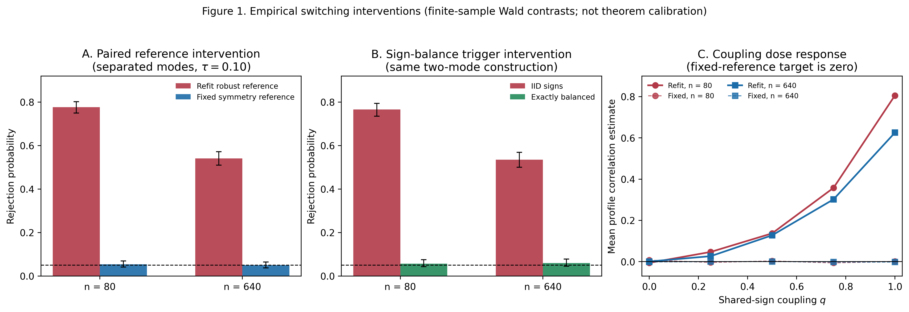
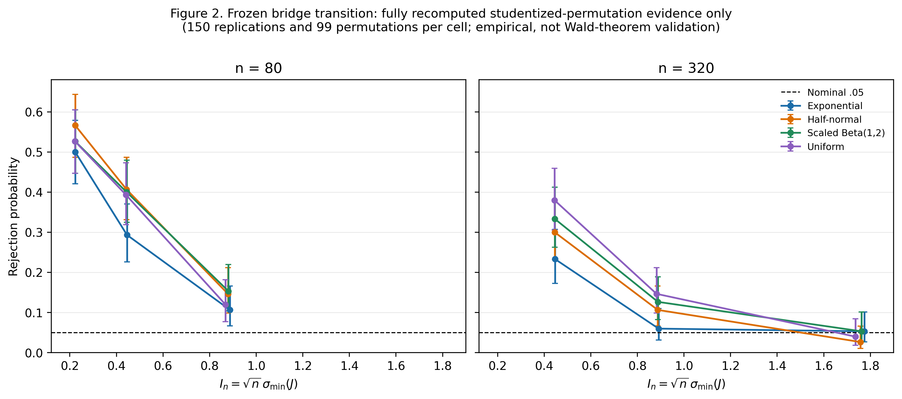
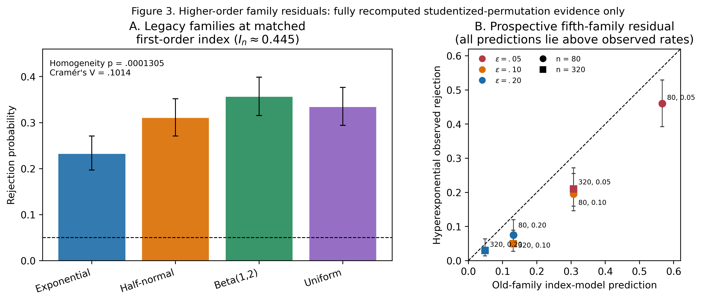

# Trustworthy Inference for Robust-Reference Divergence Profiles

## 6. Simulation design and consolidated evidence

Working manuscript draft, Section 6
Date: 2026-09-05

> Editorial note: this section only consolidates the fixed-seed, claim-directed
> results that were frozen before manuscript integration. It introduces no new
> data-generating family, distribution grid, or anomaly search. The display
> manifest `results/section6_display_manifest_20260905.tsv` records the exact
> source file and normalized SHA-256 hash for every display input.

### 6.1 Two inference tracks and one mechanism track

The simulations have three distinct evidentiary roles. They must not be read
as interchangeable.

1. The **Wald theorem-aligned track** uses fixed regular IID laws and the
   complete influence-function standard error from Theorem 1. It is a
   finite-sample check consistent with a pointwise asymptotic theorem; it does
   not establish uniform finite-sample validity.
2. The **fully recomputed studentized-permutation track** refits every
   robust-reference quantity within each permutation. It is empirical
   finite-sample evidence. Its randomization exactness requires the declared
   group-invariance null, and it is not a weak-null permutation theorem.
3. The **mechanism track** uses paired finite-sample Wald contrasts under the
   separated-mode construction. It is deliberately outside the regular
   calibration argument: fixing a reference or forcing sign balance is an
   intervention used to identify a mechanism, not a recommended general
   correction.

No main display combines the two tracks. Table 2 contains only the Wald
theorem-aligned track; Figures 2 and 3 contain only the fully recomputed
studentized-permutation track. Figure 1 is separately labelled as empirical
mechanism evidence rather than theorem calibration.

### 6.2 Regular IID Wald evidence

Table 2 records six pre-specified null cells, each with 1,000 independent
replications. The dependent-normal profile null is the regular dependent weak
null used to check that the complete paired influence function handles
cross-margin dependence. The independent \(t_5\) cells check a regular global
null with finite fourth moments. At \(n=640\), their rejection frequencies are
\(.044\) and \(.059\), respectively, and the studentized standard deviations
are \(.993\) and \(1.037\). These are compatible with the pointwise regular
IID claim, while not being a finite-sample guarantee.

The strong-skew cells give the intended boundary. Their rejection frequency
falls from \(.122\) at \(n=640\) to \(.082\) at \(n=2560\), but their
studentized distribution remains asymmetric. Because this behavior persists
when population references are fixed (Section 3.4), it is not evidence for
the reference-switching mechanism in Section 4. It is evidence for the
qualification **pointwise, not uniform**.

**Table 2. Theorem-aligned regular-IID Wald evidence.** Rejection is for a
two-sided nominal .05 test. Intervals are 95% Wilson intervals for the
Monte Carlo rejection probability; `SD(Z)` is the empirical standard
deviation of the studentized statistic.

| Fixed law and role | \(n\) | Reps | Rejection | MCSE | 95% Wilson | SD(\(Z\)) |
|---|---:|---:|---:|---:|---:|---:|
| Dependent-normal profile weak null; regular calibration | 160 | 1000 | .052 | .007 | [.040, .068] | 1.011 |
| Dependent-normal profile weak null; regular calibration | 640 | 1000 | .044 | .006 | [.033, .059] | .993 |
| Independent \(t_5\) global null; regular calibration | 320 | 1000 | .075 | .008 | [.060, .093] | 1.068 |
| Independent \(t_5\) global null; regular calibration | 640 | 1000 | .059 | .007 | [.046, .075] | 1.037 |
| Independent strong-skew null; convergence boundary | 640 | 1000 | .122 | .010 | [.103, .144] | 1.280 |
| Independent strong-skew null; convergence boundary | 2560 | 1000 | .082 | .009 | [.067, .101] | 1.136 |

The machine-readable display source is
`results/section6_display_table2_wald_20260905.tsv`.

### 6.3 Finite-sample reference-switching mechanism

Figure 1 is not a Wald calibration figure. It makes the causal evidence for
Claim 2 compact. In the \(\tau=.10\) separated-mode construction, refitted
references reject at \(.777\) and \(.541\) for \(n=80\) and 640. Holding the
same samples to the known symmetry reference changes these to \(.054\) and
\(.050\); the paired reductions are \(.723\) (MCSE .0145) and \(.491\) (MCSE
.0171). At the diffuse control \(\tau=.40\), the absolute paired difference
is at most .018. This identifies fitted-reference behavior, rather than the
fixed radial target by itself, as the active source in this construction.

The sign-balance and coupling panels provide independent mechanism checks.
Exact balance reduces the \(n=80\) rejection rate from \(.766\) to \(.058\),
and the coupling panel shows that fitted effects rise with shared-sign
coupling while fixed-zero-reference effects remain near zero. These
interventions establish that instability **can cause** severe distortion;
they do not imply that every multimodal law fails or that either intervention
is a general remedy.

**Figure 1. Empirical switching interventions.** Panel A compares refitted and
fixed symmetry references on paired samples. Panel B changes only the
sign-count trigger. Panel C changes only cross-margin sign coupling. Error
bars in Panels A--B are 95% Wilson intervals. The associated display table is
`results/section6_display_figure1_mechanism_20260905.tsv`.

### 6.4 Conditioning transition: empirical permutation evidence

Figure 2 contains the 24 frozen bridge cells: four matched-origin-density
families, \(n\in\{80,320\}\), and three bridge probabilities. Every cell uses
150 replications and 99 fully recomputed permutations. The decline in
rejection with

\[
I_n=\sqrt n\,\sigma_{\min}(J).
\]

is pronounced across the bridge construction. For example, at \(n=80\), the
four family-specific rejection rates range from \(.500\) to \(.567\) near
\(I_n=.222\), then range from \(.107\) to \(.153\) near \(I_n=.88\). At
\(n=320\), the highest-index band (\(I_n\approx1.74\)--1.77) ranges from
\(.027\) to \(.053\).

This plot is intentionally not used to validate Theorem 1. The method is a
fully recomputed studentized-permutation procedure, its weak-null validity is
not claimed, and \(I_n\) is a population explanatory quantity in this paper.
The display does not calibrate a threshold, and \(I_n\) is **not a universal cutoff**.

**Figure 2. Frozen bridge transition.** Points are rejection probabilities and
whiskers are 95% Wilson intervals. Panels separate sample sizes; colors
separate bridge families. All data are empirical fully recomputed
studentized-permutation evidence, not direct Wald-theorem validation. The
machine-readable source is `results/section6_display_figure2_bridge_20260905.tsv`.

### 6.5 Higher-order family residuals

The matched-index panel of Figure 3 makes the limitation visible rather than
burying it in a prediction score. At \(n=320\) and bridge probability .05, all
four legacy families have \(I_n\approx.445\), yet their rejection rates range
from \(.232\) to \(.356\). The family-homogeneity test gives
\(p=.0001305\) and Cramér's \(V=.1014\). Thus first-order conditioning
organizes the transition but does not determine it.

The second panel is prospective: the hyperexponential family was selected
before its rejection simulation. The bridge-trained index model improves mean
absolute error by 47.6% relative to an intercept-only prediction, but all six
old-family predictions exceed the observed rates; the smallest overprediction
is .0189. Hence the prospective evidence supports transport of a coarse
first-order ordering while preserving a systematic family residual. Possible
contributors include curvature, influence-tail behavior, and nonlocal
switching geometry; this study does not identify which higher-order component
is dominant.

**Figure 3. Higher-order residual.** Panel A uses the four 500-replication
matched-index confirmatory cells. Panel B compares predictions with observed
rates for six 200-replication prospective hyperexponential cells; vertical
whiskers are 95% Wilson intervals. This is fully recomputed
studentized-permutation evidence only. The machine-readable source is
`results/section6_display_figure3_residual_20260905.tsv`.

### 6.6 Reproducibility and interpretation

All root seeds, repetition counts, permutation counts, Wilson intervals, and
source hashes remain in the display tables and manifest. The display builder
`scripts/build_section6_displays_20260905.py` is a deterministic reporting
step: it reads the frozen result files and generates tables and figures, but
does not simulate observations or search a distribution grid. The associated
audit reconstructs every display table from its sources and checks the
evidence-track separation before any manuscript use.
